# 租房指南
更新于 Aug 11 2024

## 简介
在 Alberta ，多数房屋租赁是适用且受到 [Residential Tenancies Act (RTA)](https://open.alberta.ca/publications/r17p1) 保护的。本指南将侧重于受 RTA 保护的情况。

一般来说， RTA 不适用于以下类型的租赁[出处](https://www.alberta.ca/information-for-landlords-and-tenants)：

- 与房东或房东家人共享住处（如共享卫生间、厨房、浴室等）
- 移动房屋
- 商住两用的房产（如租下一栋双层建筑，一层作为商业空间，二层用于居住）
- 酒店、汽车旅馆、房车公园、旅游民宿等
- 来自教育机构的（除非该住处存在独立的入口、厨房、浴室等）
- 大多数养老院、支持性生活住所、政府运营的长者旅馆和惩教机构、军事基地和原住民保留地

具体信息请参照 [**RTA 适用的租赁类型**](https://www.servicealberta.ca/pdf/rtdrs/RTA_Applicability_to_Accommodations.pdf)

## 目录
- [租赁协议](#租赁协议)
    - [类型](#类型)
    - [内容](#内容)
    - [损坏押金](#损坏押金)
    - [转移](#转移)
    - [租金上涨](#租金上涨)
- [房东信息](#房东信息)
    - [如何查询](#如何查询)

## 租赁协议
:exclamation:***请注意：租赁协议中任何剥夺或放弃 RTA 中规定的租户权利的内容都是无效的。*** [出处](https://www.alberta.ca/starting-a-tenancy)

### 类型

在 Alberta，租赁协议主要分为两种：

- 定期协议：

    存在明确开始和结束日期的协议。

- 周期协议：

    存在开始日期，但不存在结束日期的协议。一般多见于 Apartment 。

:information_source: 此外，要注意的是，也存在最开始为定期协议，到期后转为周期协议的混合协议。 

### 内容

协议可以是书面的、口头的或暗示的

但为了保护自身权益，住宅租赁协议应以书面形式签订，并包含以下信息：
- 协议日期
- 各方的姓名和地址
- 住宅地址或位置描述
- 租赁期限
- 租金金额、支付地点、时间和支付方式
- 关于是否提供水电、家具、电器、停车位等以及费用由谁承担的条款
- 获准居住在住宅场所的人员姓名
- 押金金额、利息以及租期结束时房东可以扣除的金额
- 保养、维护和维修责任
- 保险要求
- 额外费用（如 NSF 费用）、客人、宠物等的规则。
- 房东和租客的签名

### 损坏押金

金额不得超过租赁开始时一个月的租金。

可以要求房东提供已支付费用的收据，包含交易金额、日期和交易方。

*押金利息必须每年支付给租客，除非房东和租客书面同意不每年支付，在这种情况下利息必须每年复利。*[出处](https://www.alberta.ca/security-deposit-interest-rate-change)

押金不得因租金上涨或租赁期间的任何其他原因而增加。

### 转移

租客可以在获得房东书面同意的情况下将其出租房屋转租或转让给他人。租赁协议应由转租人和租客签署。**房东不得无合理理由拒绝许可**，并且必须在收到书面请求后 14 天内以书面形式向租客说明理由。

如果房东在 14 天内没有答复请求，则租户可以假定房东同意转租或转让。房东不得收取同意转租的费用。

*即使转租人搬出，转租或转让租赁房屋的租户仍有可能对租约的剩余部分负责，并可以选择就其责任寻求法律建议。*

### 租金上涨
[待完成]

在 Alberta ，租金上涨的幅度是不受限的，**但**：

不能在上次涨价或租约开始一年（ 365 天）内（以较晚的为准）再次上涨。

如果第 365 天包含在固定期限的租约内，则在租约结束前不能上涨

## 房东信息

要查找房产所有权，最简单可靠的方法是结合 [Edmonton Maps](https://maps.edmonton.ca/) 和 [Alberta Land Titles and Surveys Spatial Information System (Spin2)](https://alta.registries.gov.ab.ca/) 来完成查询。[Spin2](https://alta.registries.gov.ab.ca/) 的每次查询费用为 10 CAD。

*注意：[Spin2](https://alta.registries.gov.ab.ca/) 系统是存在工作时间的 (虽然我也不清楚为什么一个自动化系统会有工作时间lmao)*

### 如何查询？
1.  确认房产的地址

2.  访问 [SLIM Maps](https://maps.edmonton.ca/map.aspx) (或访问 [Edmonton Maps](https://maps.edmonton.ca/) 并点击 `Address Lookup`)

    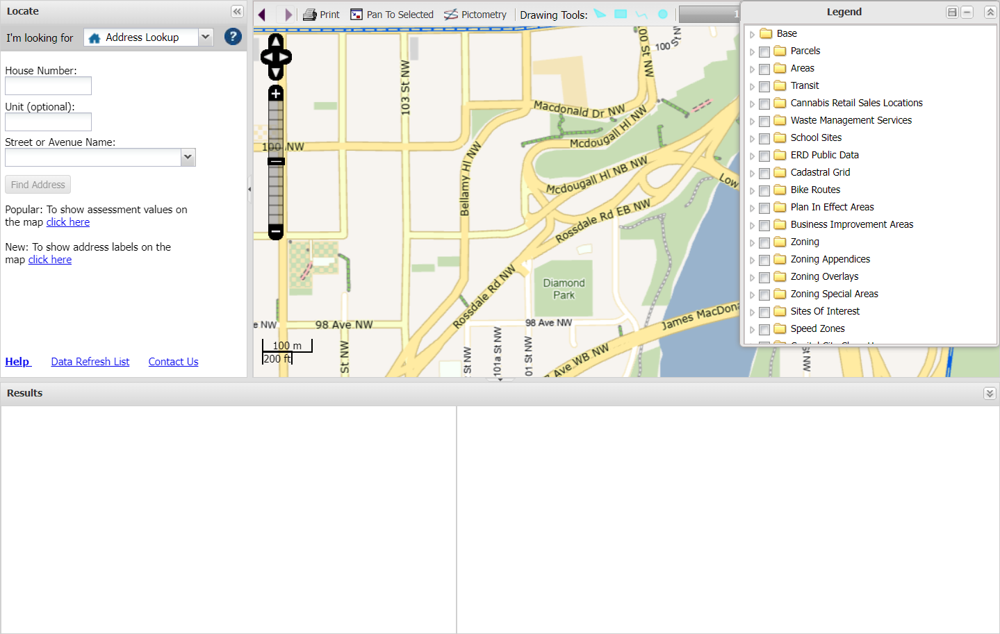

3. 输入你的地址，以 Edmonton 市政厅举例：

    Edmonton 市政厅的地址是：

    1 Sir Winston Churchill Square

    `House number` 即为 1

    `Street or Avenue Name` 即为 Sir Winston Churchill Square

    输入所有信息，自动补全 `Street or Avenue Name` 后点击 `Find Address`

    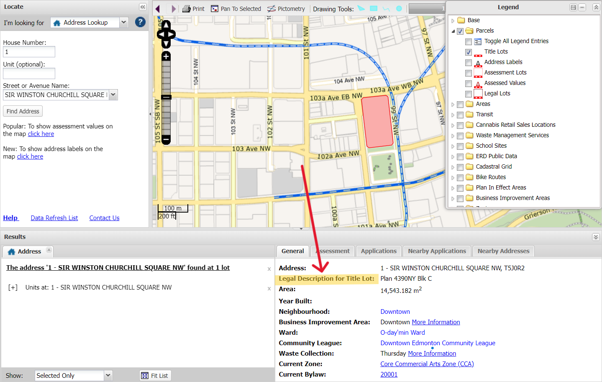

    搜索完成后结果会出现在下面的 `Results` Tab 中，在右侧的 `General` Tab 中找到 Legal Description for Title Lot（这里是 Plan 4390NY Blk C），记下来

4.  访问 [Spin2](https://alta.registries.gov.ab.ca/)， 选择Guest Login

    - 4.1 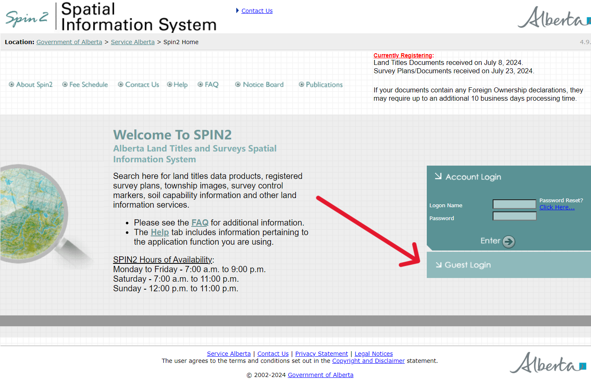

    - 4.2 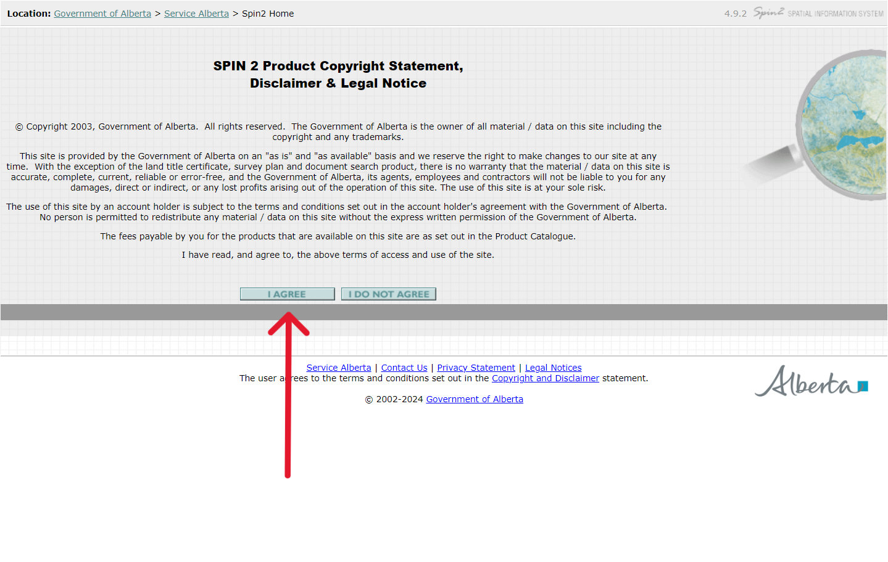
    
    - 4.3 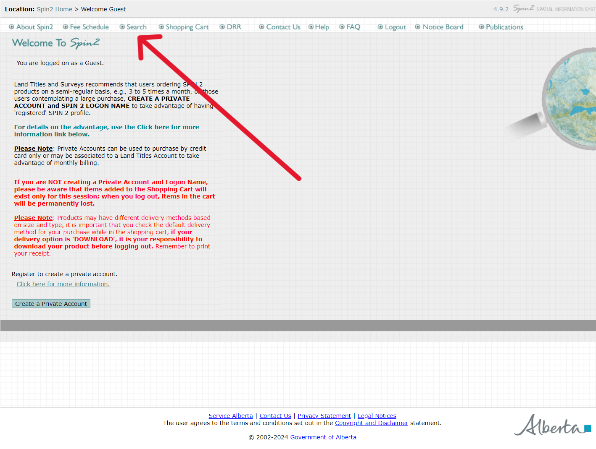

    - 4.4 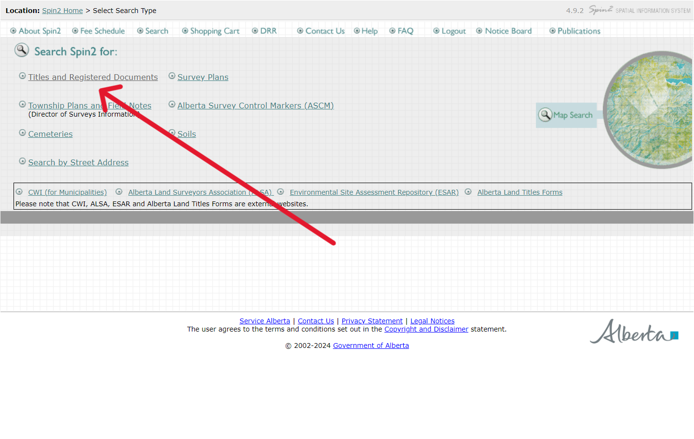

    - 4.5 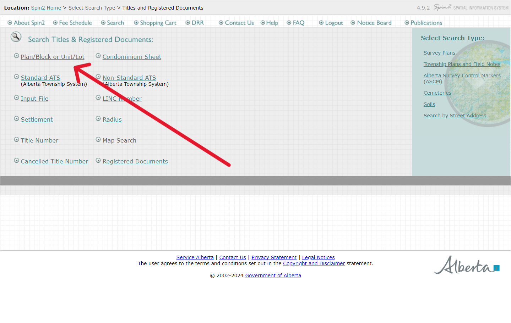
    
    - 4.6
    
        在 `Plan` / `Block/Unit` / `Lot` 中填入前面记下来的

            Plan 即为 4390NY

            Block/Unit 即为 C

            因为前面并没有 Lot ， 故置空

        点击 `Search`

        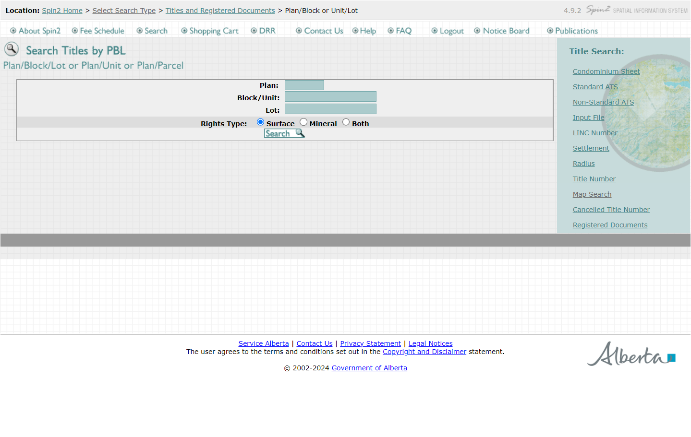

    - 4.7

        查找到对应地块后，按箭头顺序将该地块的注册书添加至购物车，并点击购物车查看

        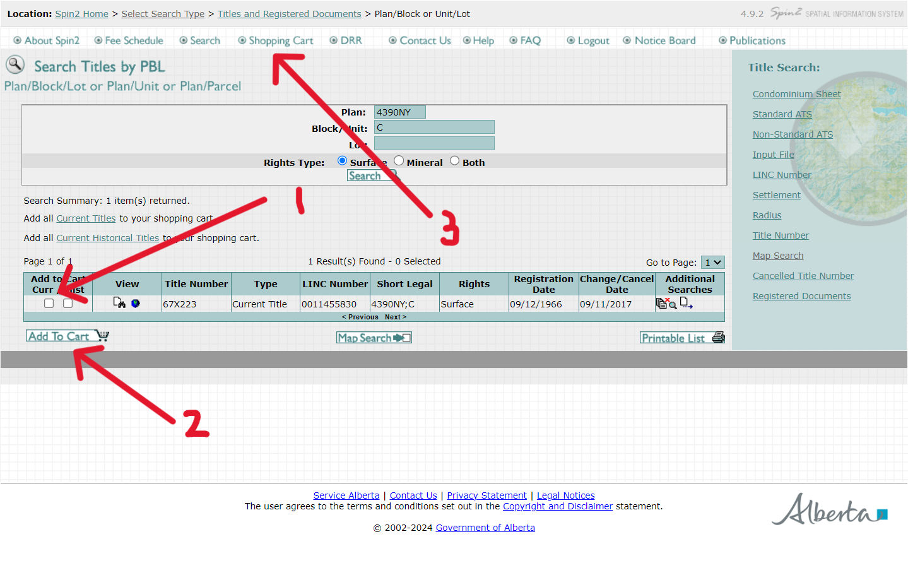

    - 4.8

        结算
        
        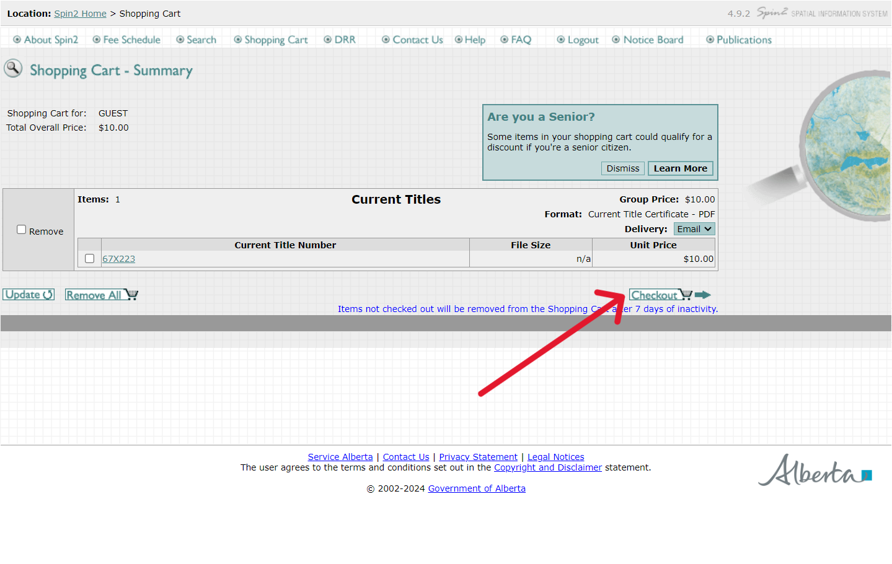

    - 4.9

        确认信息，填入正确的邮箱并结算

        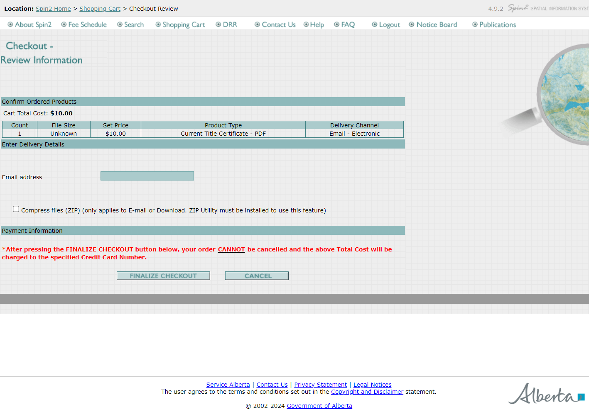

当完成以上步骤后，你会在邮箱中看到一份包含地块注册书的邮件。可以通过比对其中 Owner 的姓名来确认房产的所有权。
